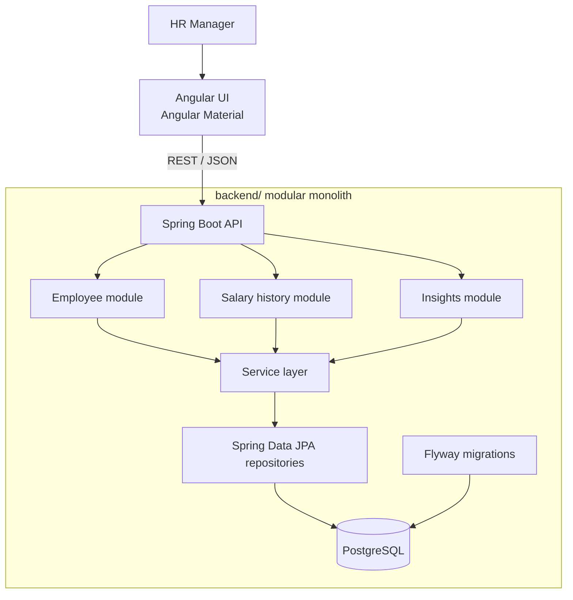

# Architecture

## Repository layout

```text
backend/       Spring Boot REST API, domain modules, persistence and Flyway migrations
frontend/      Angular application and Nginx container configuration
docs/          Requirements and engineering decisions
docker-compose.yml
```

The backend and frontend are separate applications in one Git repository. Shared setup and documentation stay at the repository root.

## Application shape



Angular owns the HR workflows and calls the REST API. Spring MVC controllers validate requests and map them to DTOs. Services hold business rules and transaction boundaries; repositories implement database-backed searching, paging, and grouped aggregates. JPA entities remain internal to the backend.

The request path is `Angular component → REST controller → service → repository → PostgreSQL`. Responses travel back as DTOs. Flyway owns schema changes and Hibernate validates mappings against the migrated schema.

## Modular monolith

The backend is one Spring Boot application and one deployment, organized around employee management, salary history, and insights. This matches the single HR workflow and 10,000-employee scale: one codebase and database are straightforward to run and test, while module and layer boundaries keep responsibilities clear. Separate services, network calls, and distributed data ownership would add operational work without a stated need.

## Deployment shape

Docker Compose runs PostgreSQL, the Spring Boot API, and an Nginx container serving the Angular production bundle. Nginx forwards `/api` and Swagger requests to the backend service. For local development, Angular CLI serves the frontend and proxies the same routes to `localhost:8080`.

## Responsibility boundaries

- **Angular:** HR workflows, form feedback, query parameters, and display of API results.
- **Controllers:** HTTP mapping, request validation, and status codes.
- **Services:** business behavior and transaction boundaries.
- **Repositories:** database search, pagination, and aggregation.
- **PostgreSQL/Flyway:** relational constraints, indexes, and versioned schema.
- **Docker Compose:** repeatable local/demo startup for the three runtime services.

Authentication, payroll, tax processing, and currency conversion are outside the initial assessment scope.
